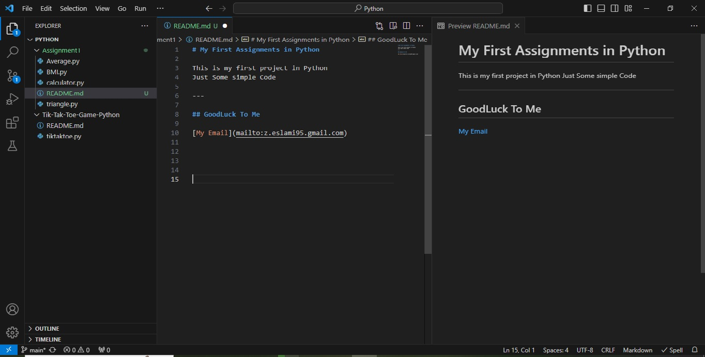

# My First Assignments in Python

This is my first project in Python
Just Some simple Code

---

## GoodLuck To Me 

[My Email](mailto:z.eslami95.gmail.com)

It's Just A Test



|    | Test Right |
|-|-----|
| Hello | Hi |
| Goodbye | Bye |

### Title 

Please Do This:
```
 You Can Type A Test Or Any Additional Things

```


## :)
- First
- Second

